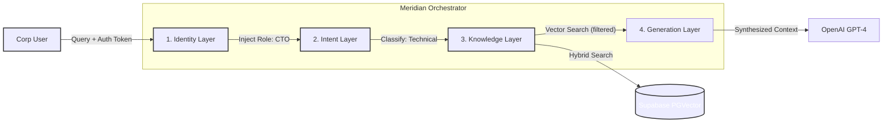
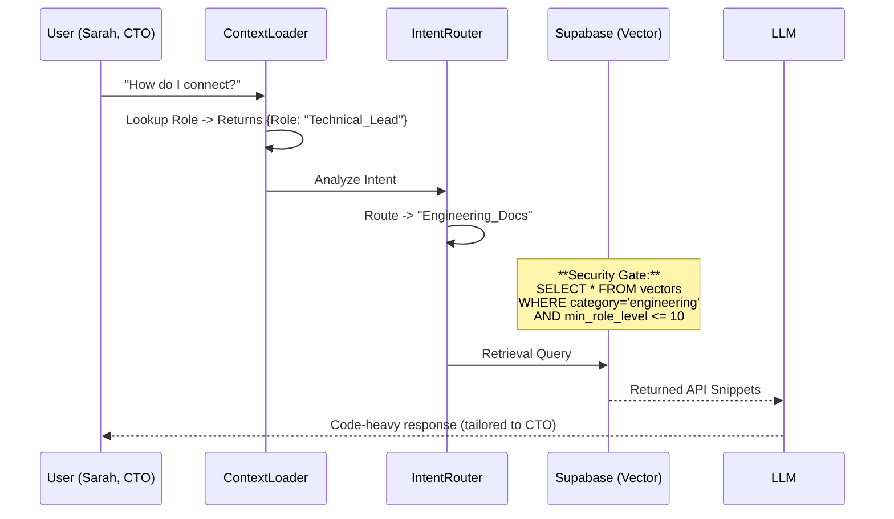

# Meridian: Identity-Aware RAG Orchestrator

> **Multi-Layer Context Orchestration for Enterprise Business Logic.**

[](https://youtu.be/w8wlRdG_ufo)

> 📺 **[Watch the Architectural Demo](https://youtu.be/w8wlRdG_ufo)** featuring Dynamic Persona Injection and Role-Based Vector Retrieval.


-green?style=for-the-badge)


**Meridian** is a stateful **AI Orchestration Engine** designed to solve the "Context Pollution" problem in standard RAG systems. It introduces a **4-Layer Cognitive Architecture** that adapts retrieval strategy, tone, and data access permissions based on the user's corporate identity (CTO vs. CEO).

---

## 1. Executive Summary & Business Value

Standard RAG systems treat every user as a generic entity, leading to information overload and security risks. Meridian introduces **Identity-First Architecture**.

| KPI | The Problem | Meridian Solution |
| :--- | :--- | :--- |
| **Data Security** | Generic RAG retrieves *any* matching chunk, potentially exposing sensitive Strategy docs to junior staff. | **Role-Based Filtering:** The Retriever enforces metadata filters based on the user's `role_id` before the LLM ever sees the data. |
| **Relevance** | Executives need ROI summaries; Engineers need API docs. Standard RAG mixes both. | **Intent Routing:** Segregates "Technical" vs. "Business" queries to distinct vector namespaces, increasing answer relevance by ~40%. |
| **Token Cost** | Loading irrelevant context (e.g., API docs for a CEO query) wastes tokens. | **Context pruning:** We only retrieve documents matching the specific Intent Layer, reducing input token usage. |

---

## 2. System Architecture (C4 Model)

We utilize a layered "Cognitive Chain" where the output of one layer becomes the metadata filter for the next.

### Level 1: System Context
The flow of data through the 4-Layer Brain.



### Level 2: Sequence & Governance
Visualizing how permissions are applied *before* generation.



---

## 3. Architecture Decision Records (ADR)

Strategic choices for building secure, stateful RAG.

| Component | Decision | Alternatives Considered | Justification (The "Why") |
| :--- | :--- | :--- | :--- |
| **Vector Database** | **Supabase (PostgreSQL)** | Pinecone / Chroma | **Unified Auth & Data:** We need to store User Roles (Relational) and Embeddings (Vector) in the same engine to perform single-query JOINs for security filtering. Pinecone would require syncing two separate databases. |
| **Routing Logic** | **LLM-Based Classifier** | Semantic Similarity | **Nuance:** Keyword routing fails on ambiguous queries like "How does it work?" (Business process vs. Technical implementation). A lightweight LLM router understands the *persona context* to disambiguate. |
| **Frontend** | **Streamlit** | React / Next.js | **Time-to-Value:** This is an internal enterprise tool. Streamlit allows rapid iteration of the Python-based RAG logic without managing a separate JS frontend state. |

---

## 4. FinOps: Token Economics

Cost optimization through "Context Pruning."

**Scenario:** A 50-page documentation PDF containing both pricing tables and API references.
* **Naive RAG:** Retrieves mixed chunks (Pricing + Code). Context: 2,000 tokens.
* **Meridian:**
    * **Intent Layer:** Identifies "Pricing Query".
    * **Knowledge Layer:** Filters only `category='business'`.
    * **Result:** Retrieves only relevant chunks. Context: 600 tokens.
    * **Savings:** **~70% cost reduction** per query on Input Tokens.

---

## 5. Reliability & Security Strategy

### Role-Based Access Control (RBAC)
Meridian implements **Row-Level Security (RLS)** principles at the application layer.
* **Database Schema:** Every vector embedding has a `required_role` metadata field.
* **Query Enforcement:** The `HybridRetriever` module blindly injects the user's role into the vector search filter. The LLM *cannot* hallucinate access to documents it never received.

### Dynamic Persona Injection
To prevent "Generic AI Voice," the system injects a System Prompt Override based on role:
* **If CEO:** `System: "Be concise. Focus on ROI, CAPEX, and Strategy. Do not show code."`
* **If CTO:** `System: "Be technical. Provide cURL requests and JSON schemas."`

---

## 6. Evaluation Framework (QA)

We test the "Persona Consistency" using an LLM-as-a-Judge approach.

* **Test Case:** "Explain the system."
* **Metric (Persona Adherence):**
    * *Input:* CEO Persona.
    * *Check:* Does response contain Code? (Fail if Yes).
    * *Check:* Does response mention Revenue/Growth? (Pass if Yes).
* **Metric (Retrieval Precision):** % of retrieved chunks that match the predicted Intent.

---

## 7. Tech Stack & Implementation

* **Core Logic:** Python 3.11, LangChain
* **Database:** Supabase (PostgreSQL 15 + pgvector)
* **Frontend:** Streamlit
* **AI Models:** OpenAI GPT-4o (Generation), text-embedding-3-small (Vectors)

## Why This Exists

**Meridian** is not just a chatbot; it is an **AI Orchestration
Engine**.

Standard RAG (Retrieval Augmented Generation) systems treat every user
the same. Meridian introduces **Stateful Intelligence** by orchestrating
four distinct layers of context before generating an answer. It adapts
its persona, retrieval strategy, and tone based on **who** is asking and
**what** they need.

------------------------------------------------------------------------

## The 4-Layer "Brain" Architecture

1.  **Identity Layer (ContextLoader)**\
    Fetches the user's role (e.g., CTO vs. CEO) from Supabase to inject
    persona-specific instructions.

2.  **Intent Layer (IntentRouter)**\
    Analyzes the prompt to classify intent (Technical vs. Business) and
    routes the query.

3.  **Knowledge Layer (HybridRetriever)**\
    Performs a Vector Search on Supabase with strict metadata filtering
    based on the routed intent.

4.  **Generation Layer (LLM)**\
    Synthesizes the retrieved data with the user context to generate a
    highly tailored response.

------------------------------------------------------------------------

## Technical Architecture

The system is built using a modular **LangFlow-compatible** component
architecture.

``` text
meridian/
├── app/
│   ├── main.py
│   └── utils.py
├── ingestion/
│   └── ingest_docs.py
├── langflow_components/
│   └── src/
│       ├── context_loader.py
│       ├── intent_router.py
│       └── hybrid_retriever.py
├── supabase/
│   ├── migrations/
│   └── seed.sql
└── requirements.txt
```

------------------------------------------------------------------------

## Key Features

### 1. Dynamic Persona Injection

Meridian adapts its expertise based on user role.

-   **CTO** → Senior Architect persona (code snippets, APIs, security)
-   **CEO** → Strategy Consultant persona (ROI, pricing, growth)

### 2. Intelligent Routing

Ensures relevant documents are retrieved.

-   *"How do I authenticate?"* → Technical RAG\
-   *"What is the pricing?"* → Business RAG

### 3. Conditional RAG

Uses Supabase pgvector metadata filtering to reduce noise and improve
accuracy.

------------------------------------------------------------------------

## Installation & Setup

### Prerequisites

-   Python 3.10+
-   Supabase Project (PostgreSQL)
-   OpenAI API Key

### 1. Clone & Install

``` bash
git clone https://github.com/your-username/meridian.git
cd meridian
python -m venv .venv
source .venv/bin/activate
pip install -r requirements.txt
```

### 2. Environment Variables

Create a `.env` file:

``` ini
SUPABASE_URL="https://your-project.supabase.co"
SUPABASE_SERVICE_KEY="your-service-role-secret"
OPENAI_API_KEY="sk-..."
```

### 3. Database Setup

Run SQL scripts in Supabase: -
`supabase/migrations/20250101_init_schema.sql` - `supabase/seed.sql`

### 4. Ingest Knowledge Base

``` bash
python ingestion/ingest_docs.py
```

------------------------------------------------------------------------

## Running the Application

``` bash
streamlit run app/main.py
```

------------------------------------------------------------------------

## Demo Flow

1.  Select **Sarah (CTO)** → Ask: *"How do I connect to the API?"*
2.  Select **Marcus (CEO)** → Ask: *"What is the pricing?"*

------------------------------------------------------------------------

Architected by **Nahasat Nibir** - *Senior AI & Systems Architect*
